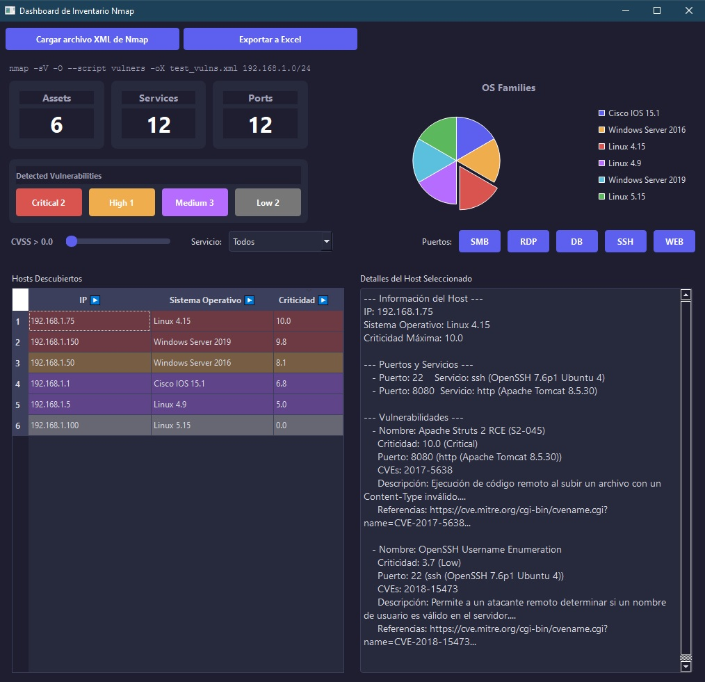

# 🛡️ Nmap Dashboard Analyzer (Nmap Parser)

Este proyecto es una aplicación de escritorio (GUI) desarrollada en Python (PySide6) diseñada para transformar los reportes de escaneo de Nmap en formato XML en un dashboard interactivo y priorizado. Es ideal para analistas de seguridad y pentesters que buscan visualizar rápidamente la superficie de ataque, identificar hosts críticos y filtrar vulnerabilidades por CVSS o servicio.

---

## ✨ Características Principales

* **Análisis Robusto:** Procesa archivos XML generados por Nmap (usando el script `vulners`).
* **Priorización CVSS:** Calcula y muestra la criticidad máxima por host, con codificación de color (Crítico, Alto, Medio, Bajo).
* **Filtrado Avanzado:** Permite filtrar los hosts por **puntuación CVSS mínima** (usando un deslizador) y por **servicios comunes explotables** (como SMB, RDP, DB, etc.).
* **Interfaz Profesional:** Diseño moderno en modo oscuro con tabla de activos ordenable y un panel de detalles.
* **Exportación:** Genera un reporte detallado en formato **Excel (.xlsx)** con formato y estilos aplicados (requiere las dependencias `pandas` y `openpyxl`).



---

# ⚙️ Instalación y Configuración

Sigue estos pasos para configurar tu entorno e instalar las dependencias necesarias.

### 1. Requisitos Previos

Necesitas tener **Python 3** y el gestor de paquetes **pip** instalados.

### 2. Crear y Activar el Entorno Virtual

Navega hasta la carpeta raíz de tu proyecto e inicializa un entorno virtual.


## Navega hasta la carpeta del proyecto

## 1. Crea el entorno virtual (lo llamaremos 'env')
```bash
python -m venv env
```
## 2. Activar el Entorno

## En Windows (CMD / PowerShell):
```bash
.\env\Scripts\activate
```

## 3. Instalar las Dependencias

Con el entorno activado (env), usa pip para instalar todas las bibliotecas necesarias listadas en requirements.txt.


## Instala las dependencias (PySide6, pandas, openpyxl, etc.)

```bash
pip install -r requirements.txt
```
# 💻 Cómo Ejecutar el Programa
Una vez que el entorno virtual esté activo y las dependencias instaladas, ejecuta el script principal:
```bash
python Dashboard.py
```

# 🔍 Uso
Haz clic en el botón "Cargar archivo XML de Nmap".

Selecciona un archivo XML generado por Nmap 

Utiliza el Deslizador CVSS Mínimo y los botones de Puertos Comunes (SMB, RDP, etc.) para priorizar los hosts en la tabla.

Haz clic en cualquier fila para ver el detalle de vulnerabilidades, puertos y servicios en el panel lateral derecho.

Usa "Exportar a Excel" para generar un reporte con formato.

### 📄 Estructura del Proyecto
Dashboard.py: Contiene la lógica de la Interfaz Gráfica (PySide6) y toda la interacción del usuario.

active_inventory_generator.py: El "motor" de parsing. Contiene las funciones para leer y estructurar el XML de Nmap.

excel_exporter.py: Módulo dedicado al formateo y generación del archivo .xlsx (usa Pandas y OpenPyXL).

requirements.txt: Lista de dependencias del proyecto.


# 🚀 Generación del Ejecutable (.exe)
Una vez que el proyecto está completo y todas las dependencias están instaladas, utiliza PyInstaller para empaquetar la aplicación en un único archivo ejecutable (.exe).

### 1. Ejecuta el siguiente comando desde tu entorno virtual activo (env). 

Este comando incluye todas las optimizaciones necesarias para aplicaciones de interfaz gráfica (GUI):Bash(env) 

```bash
pyinstaller --onefile --windowed --icon=C:\ruta\a\tu\icono\nmap-dashboard-analyzer\ico.ico Dashboard.py
```
### 2. 📋 Resumen de las Opciones

| Opción | Propósito |
| :--- | :--- |
| `pyinstaller` | Herramienta principal para el empaquetado. |
| `--onefile` | Genera un único archivo `Dashboard.exe` en la carpeta `dist/`. |
| `--windowed` | Indica que la aplicación es de GUI, **evitando que se abra la ventana de consola** de fondo. |
| `--icon=...` | Asigna tu archivo `.ico` al ejecutable para que tenga un icono personalizado. |
| `Dashboard.py` | Tu script principal. |


### 3. Ubicación del ArchivoDespués de ejecutar el comando, el archivo ejecutable final (Dashboard.exe) se encontrará dentro de la carpeta dist/ en el directorio de tu proyecto.
